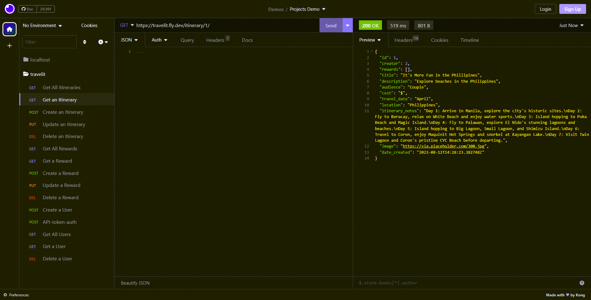

# SHAREit (formerly TRAVELit) - DRF Backend
by Yara Fe Tuguinay
She Codes Crowdsourcing Project based on Django Rest Framework

## About
Ready to explore the world without getting lost in the details? Introducing SHAREit (formerly TRAVELit) - your ultimate travel companion! 🌏✈️ 
Say goodbye to travel planning headaches and hello to tried and tested itineraries from fellow travellers! 
Use this crowdsourcing platform to find itineraries based on your destination, travel period, budget, etc.
Have an awesome itinerary? Share it with us and our community, and if someone likes it, they might even give you a reward!

## Features
SHAREit includes the following features:
|  FEATURE  |  DESCRIPTION  |
|---|---|
|  Account Creation  |  Anyone can create an account |
|  User Profile  |  An authenticated user can view details of their account   An authenticated user can update or delete their profile |
|  Itineraries  |  An authenticated user can create an itinerary  An authenticated user can view all itineraries  An authenticated user can view details of an itinerary  An authenticated user can only update or delete their own itineraries |
|  Rewards  | An authenticated user can award   a reward against an itinerary or itineraries An authenticated user can view all rewards An authenticated user can view details of a reward An authenticated user can only update or delete their own rewards |
| Token Creation | A user can create a token to be used for API authentication |

### Stretch Goals
* [] User cannot reward their own itineraries
* [] User can favourite an itinerary
* [] User can share itinerary via email or social media
* [] User can search for an itinerary
* [] User can add tags to an itinerary that's searchable

## API Specification
| **HTTP Method** | **URL** | **Purpose** | **Request Body** | **Successful Response Code** | **Authentication/ Authorization** |
|:---:|:---:|:---:|:---:|:---:|:---:|
| **GET** | /itinerary/ | Returns all itineraries | N/A | 200 - OK | N/A |
| **GET** | /itinerary/1 | Returns the itinerary with ID = 1 | N/A | 200 - OK | N/A |
| **POST** | /itinerary/ | Creates a new itinerary | Project objcet | 201 - Created | Must be logged in |
| **PUT** | /itinerary/1/ | Updates the itinerary with ID=1 | Project object | 200 - OK | Must be logged in      Must own the itinerary or is a superuser or admin |
| **DELETE** | /itinerary/1/ | Deletes the itinerary with ID=1 | N/A | 204 - No Content | Must be logged in      Must own the itinerary or is a superuser or admin |
| **GET** | /rewards/ | Returns all rewards | N/A | 200 - OK | N/A |
| **GET** | /rewards/1 | Gets the reward with ID=1 | N/A | 200 - OK | N/A |
| **POST** | /rewards/ | Creates a new reward | Reward Object | 201 - Created | Must be logged in      Must own the reward or is a superuser or admin |
| **PUT** | /rewards/1/ | Updates the reward with ID=1 | Reward object | 200 - OK | Must be logged in      Must own the reward or is a superuser or admin |
| **DELETE** | /rewards/1 | Deletes the reward with ID=1 | N/A | 204 - No Content | Must be logged in      Must own the reward or is a superuser or admin |
| **GET** | /users/ | Returns all users | N/A | 200 - OK | N/A |
| **GET** | /users/1 | Gets the user with ID=1 | N/A | 200 - OK | N/A |
| **POST** | /users/ | Creates a new user | CustomUser Object | 201 - Created | N/A |
| **PUT** | /users/1/ | Updates the user with ID=1 | CustomUser object | 200 - OK | Must be logged in      Must own the user account or is a superuser or admin |
| **DELETE** | /users/1 | Deletes the user with ID=1 | N/A | 204 - No Content | Must be logged in      Must own the user account or is a superuser or admin |
| **POST** | /api-token-auth/ | Creates a token for a user | Username and password | 200 - OK | Must have a user account |

## Database Schema

## Wireframes
{{ Insert your wireframes }}

## Colour Scheme
|Name| HEX
|:---:|:---:
|midnight-green| #005454ff
|cal-poly-green| #27480Bff
|moss-green| #A0A44Aff
|taupe-gray| #847D8Aff
|french-gray| #AEABB2ff
|magnolia| #F2F3FFff
|asparagus| #629255ff

## Fonts
* BebasNeue
* MuseoSlab
* MuseoSans
* Lato

## Submission Documentation

Deployed Project: [SHAREit Deployed Website](https://travelit.fly.dev/itinerary/)

### How To Run

Step | Action | Command
| :--- | :--- | :--- 
| 1 | Clone repo to your local machine - run git bash from local directory and clone repo via terminal| `git clone https://github.com/yara-fe/travelit_drf.git`
| 2 | Check pip version | `python -m pip --version`
| 3 | If not available, run command to install |`python -m ensurepip --upgrade`
| 4 | Create and activate virtual environment to run Django app |`python -m venv venv`   `. venv/Scripts/activate`
| 5 | Install project requirements |`python -m pip install -r requirements.txt`
| 6 | Check installation successful |`python -m pip freeze`
| 7 | Launch VS code   Note: VS code will open. Leave as is and return to GitBash terminal to continue |`code .`
| 8 | Make initial migrations in project directory | `cd she_codes_news`   `python manage.py migrate`
| 9 | Run local web server | `python manage.py runserver`
| 10 | Launch website | http://127.0.0.1:8000/itinerary/

### How To Register a New User
1. Open Insomnia and create a new HTTP Request
2. Change the GET method to POST and enter the URL to the user endpoint: `https://travelit.fly.dev/users/`
3. Set the Body type to JSON and enter the following 

    To create a new super user (i.e. admin privileges):
   `{
		"is_superuser": true,
		"username": "<enter username>",
		"password": "<enter password>",
        "email": "<enter email>"
	}`

    OR

    To create a normal user:
    `{
		"is_superuser": false,
		"username": "<enter username>",
		"password": "<enter password>",
        "email": "<enter email>"
	}`

4. Click 'Send' to make the request. If successful, you should receive a response with status code 201 Created, and the JSON data containing the registered user's information.

### Create a User Token
A token is required to authorize a user to use other methods, such as POST, DELETE and UPDATE

6. Create a new HTTP Request and set the method to POST. This time enter the API-Token-Auth endpoint: 'https://travelit.fly.dev/api-token-auth/'
7. Set the Body type to JSON and enter the following:
    `{
		"username": "<your username>",
		"password": "<your password>"
	}`
8. Click 'Send'. If successful, you should receive a response with status code 200 OK and a token will be created.

### Use Token for Authorization
You can now enter this token in new HTTP Requests that you create that requires authorization. 

9. Once you have created a HTTP request, go to the Auth tab and select Bearer Token
10. Under Token, paste the token you have created for your user.
11. In Prefix, type in Token. Lastly, ensure Enabled is ticked. 
12. You can now return to the Body/JSON tab and send your request. Your request should be successful as your user authorization is now set.

### Screenshots
The following are sample screenshots of request methods performed via Insomnia. For more screenshots, please refer to the screenshots folder in the project.

* [x] A successful GET method for all itineraries - Status Code 200 OK
* [ ] 

* [x] A successful GET method for one itinerary - Status Code 200 OK 
()

* [x] A successful POST method for a token - Status Code 201 Created

* [x] A successful POST method for a reward - Status Code 201 Created

* [x] An unsuccessful POST method for a reward due to user not being authorized - Status Code 401 Unauthorized

* [x] An unsuccessful PUT (i.e. update) method for a reward due to user not being the owner of reward - Status Code 403 Forbidden

* [x] A successful DELETE method for an itinerary - Status Code 204 No Content

